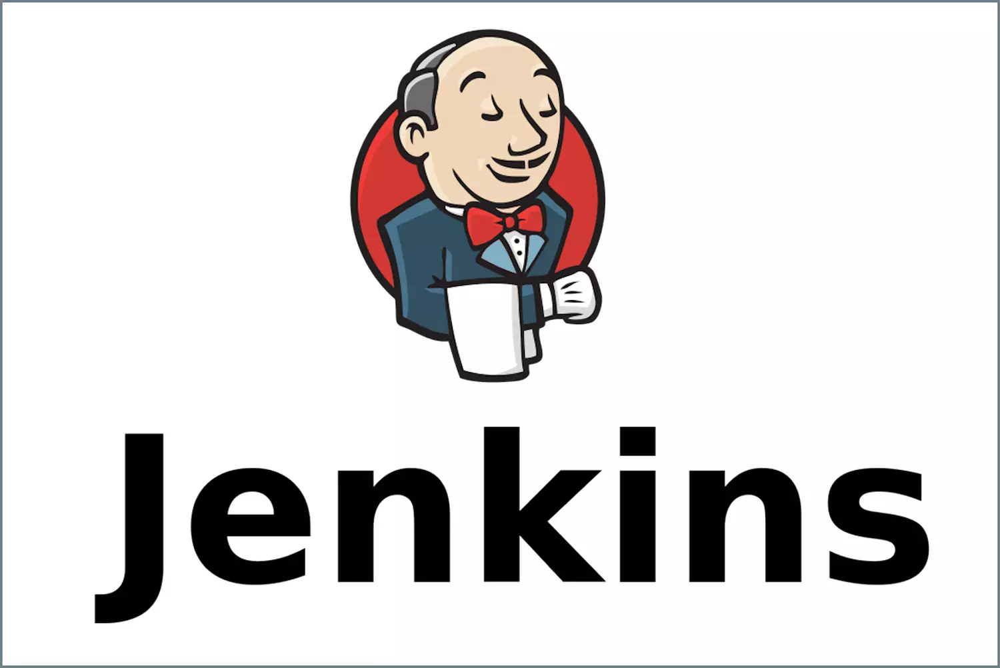

# Portfolio personnel avec CI/CD Jenkins



Ce projet est un portfolio web personnel qui met en avant des projets Cloud, DevOps, réseaux, système et développement web. Il inclut un frontend React/Vite, une API Node.js/Express, une base de données MongoDB, la conteneurisation Docker, et un pipeline Jenkins pour l'intégration continue.

## Aperçu du projet

- Frontend React moderne dans `ux_react`
- Backend Express dans `api`
- Base de données MongoDB gérée par Docker Compose
- Analyse de code avec SonarQube
- Pipeline Jenkins défini dans `Jenkinsfile`
- Déploiement avec Docker Compose et images Docker

## Fonctionnalités principales

- Portfolio responsive avec pages : accueil, compétences, projets et contact
- Interface d'administration privée
- API backend pour la gestion des contenus
- Téléchargement de CV
- Conteneurisation complète via Docker Compose
- Pipeline CI/CD Jenkins
- Analyse de qualité avec SonarQube

## Stack technique

- React 18 + Vite
- Node.js + Express
- MongoDB
- Docker / Docker Compose
- Jenkins
- SonarQube
- Mongoose
- Multer

## Démarrage local

1. Cloner le dépôt :

```bash
git clone https://github.com/dsenghor96/Jenkins.git
cd PROJET_JENKINS
```

2. Lancer les services Docker :

```bash
docker compose up -d --build
```

3. Accéder à l'application :

- Frontend : `http://localhost:5173`
- Backend : `http://localhost:3000`
- SonarQube : `http://localhost:9000`

## Jenkins CI/CD

La pipeline Jenkins est définie dans `Jenkinsfile` et couvre les étapes suivantes :

1. Checkout du code
2. Exécution de l'analyse SonarQube
3. Construction des images Docker frontend et backend
4. Publication des images sur DockerHub
5. Déploiement des services Docker

### Variables Jenkins utilisées

- `DOCKERHUB_USER`
- `BACKEND_IMAGE`
- `FRONTEND_IMAGE`
- `dockerhub-credentials` (credentials Jenkins)
- `SONAR_HOST_URL`
- `SONAR_AUTH_TOKEN`

## Structure du dépôt

```text
PROJET_JENKINS/
├── api/                # Backend Express
├── ux_react/           # Frontend React + Vite
├── docker-compose.yml  # Orchestration Docker
├── Jenkinsfile         # Pipeline Jenkins CI/CD
└── jenkins-logo.svg    # Logo Jenkins ajouté au README
```

## Remarques

- Les configurations sensibles et les identifiants ne sont pas stockés dans le dépôt.
- Utilisez des variables d'environnement ou des fichiers `.env` locaux pour les paramètres de connexion.

## Contact

Dieynaba Senghor

- LinkedIn : [linkedin.com/in/dieynaba-senghor](https://linkedin.com/in/dieynaba-senghor)
- GitHub : [github.com/dieynaba-senghor](https://github.com/dieynaba-senghor)
